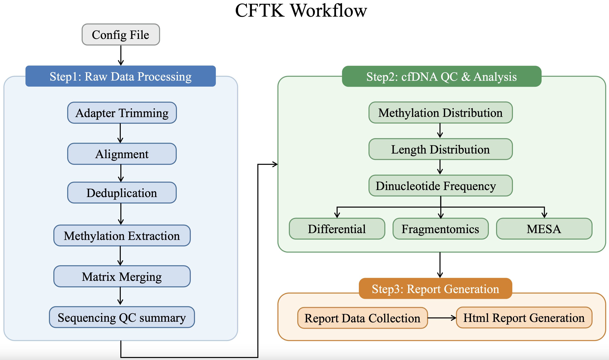

Cell-free DNA Toolkit Documentation
===================================
.. toctree::
   :maxdepth: 2
   :hidden:
   :caption: Start

   installation
   getting_started

.. toctree::
   :maxdepth: 2
   :hidden:
   :caption: User Guide

   user_guide/index

.. toctree::
   :maxdepth: 2
   :hidden:
   :caption: Reference

   reference/index

.. toctree::
   :maxdepth: 1
   :hidden:
   :caption: Project

   development

.. rst-class:: cftk-hero

CFTK is a versatile cfDNA analysis toolkit designed for NGS based cfDNA Bisulfite-sequencing data processing. The workflow was organized for rawdata processing, data quality control, differential methylation analysis, fragmentomics analysis and multimodal machine learning modeling. We also provide a html report for result summarizing.

The current workflow is driven by the ``cftk`` command implemented in ``cftk.py`` and controled by the user-prepared config file ``cftk_init.json``.

Please follow the guides below to explore more details about the CFTK package.

.. grid:: 1 1 2 2
   :gutter: 2

   .. grid-item-card:: Installation
      :link: installation
      :link-type: doc

      Install CFTK, set up the enviroment and dependiencies for running. 

      
   .. grid-item-card:: Get Started
      :link: user_guide/index
      :link-type: doc

      Set up the initial config file ``cftk_init.json`` for your samples and explore standard CFTK workflow.

   .. grid-item-card:: Run Workflows
      :link: getting_started
      :link-type: doc

      Run CFTK workflow step by step or use the ``run-all`` command to finish all steps end to end.

   .. grid-item-card:: Command Reference
      :link: reference/cli
      :link-type: doc

      Explore all the available ``cftk`` commands and its function.

.. grid:: 1
   :gutter: 2

   .. grid-item-card:: Report Demo
      
      This report was generated using all the results from the CFTK workflow.
      
      .. raw:: html

         

         <a href="_static/sample_report.html" target="_blank" style="
            display: inline-block;
            background-color: #1b1233;
            color: white;
            padding: 10px 20px;
            text-decoration: none;
            border-radius: 4px;
            font-weight: bold;
            margin-bottom: 8px;
         ">Open report</a>
          
         <a href="_static/sample_report.html" download style="color: #555; text-decoration: underline; font-size: 0.9em;">Download full report &gt;</a>

